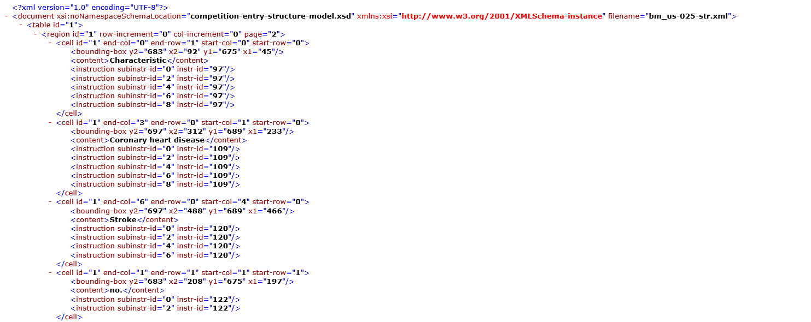
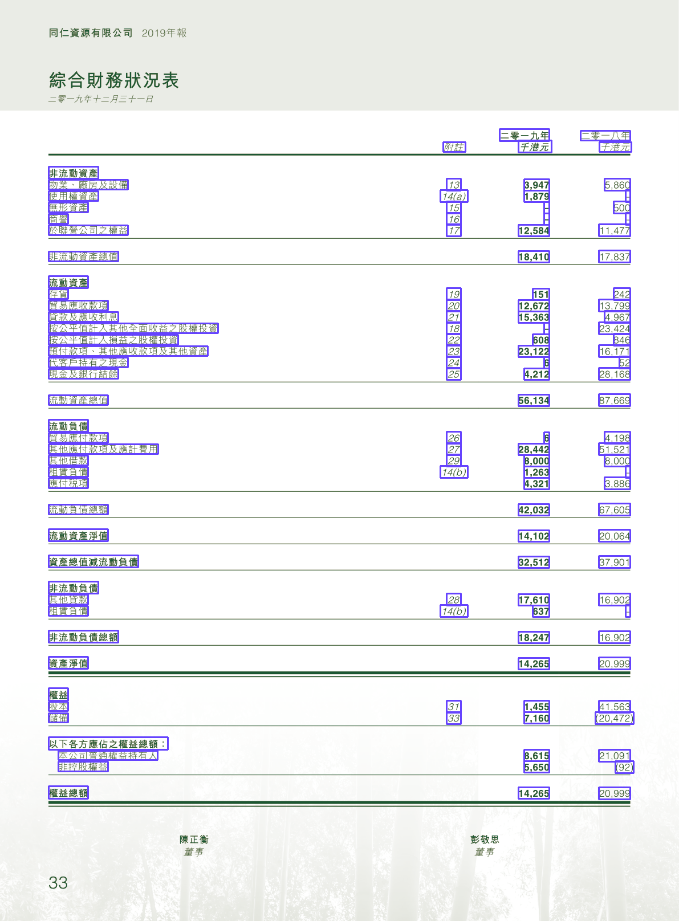
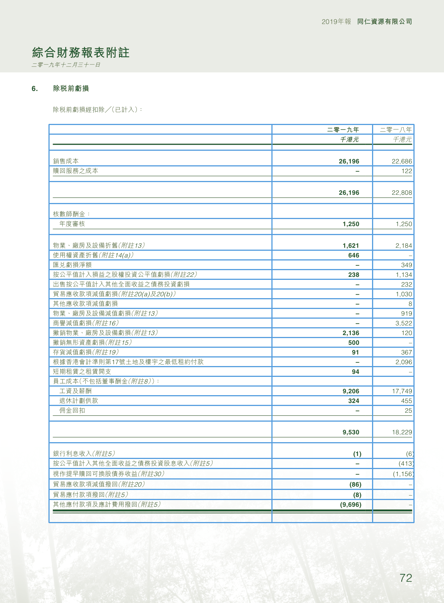

# PDF Table Detection


## 项目简介
&emsp;&emsp;数字化时代的来临，让电子文档正在快速取代纸质文档。这些电子文档中包含大量基于表格的信息，表格信息是企业数据分析的重要来源，过往表格信息的提取主要依靠人工来完成，效率低且容易出错。顺应办公自动化的潮流，我们提出了pdfTableDetection，模型可以自动识别并提取PDF中的表格信息，模型主要分为表格检测模型、表格文字提取模型、表格重构模型和表格线绘制模型，模型架构图如下图所示：


&emsp;&emsp;下面我们将从模型运行环境、模型调用方式、数据集、模型基本架构、模型效果、使用MMdetection搭建模型、构建CPU上运行的MMdetection七个方面讲述。


## 运行环境

- 操作系统：centos 8.2
- Python 3.6.12
  - torch==1.4.0
  - torchvision==0.5.0
  - mmcv==0.4.3
  - mmcv-full==1.0.0
  - pycocotools==2.0.2
  - lxml
  - openpyxl
  - opencv-python
  - PyMuPDF
  - Pillow
其余详情见requirements.txt

### 环境安装
```shell
conda create -n pdf python=3.6
conda activate pdf
pip install -r requirements.txt
```
我们提供了一些重要的package方便你进行环境的配置：
```html
https://pan.baidu.com/s/12_015vxX8auSpgPlibkuBg
```

提取码：

```
1234
```

MMdetection模型推理我们构建了CPU版本，不需要再配置MMdetection相关环境。


## 模型调用方式

### 运行模型
请下载模型检查点，并放置到Model目录下。

Checkpoint: 
```
https://pan.baidu.com/s/1cKnxcdNhRY-7h9dtXgcsNg
```

提取码：
```
1234
```
假设PDF名为xxx.pdf，在Files文件夹下新建xxx文件夹，将xxx.pdf放入xxx文件夹中。

运行代码：
```shell
cd Model
python main.py xxx
```
运行结果保存在xxx文件夹中，xlxs文件夹下为生成的Excel结果，img文件夹下为画线完成的图片，xxx_.pdf是处理完的pdf（带表格线），chunks文件夹下是中间的处理信息，xxx.json中存储了哪些页中包含几张表格。


### 训练模型

你可以下载并运行我们提供的docker镜像，docker中我们配置了训练环境，你可以在我们的预训练检查点上继续训练自己的模型，如果你需要配置训练环境，可以参考[MMdetection安装](https://zhuanlan.zhihu.com/p/81755089?utm_source=wechat_session)。
```html
https://pan.baidu.com/s/19s65dJUV2iYMkZSfkAzffA
```

提取码：

```
1234
```
需要配置好config.py中的文件后，运行如下命令，进行模型训练（记得把检查点文件放置到同级目录下）:smirk:
```shell
cd /mmdetection/tools
python train.py ./config.py
```


## 数据集

本项目使用[ICDAR2013、ICDAR2019](https://github.com/sgrpanchal31/table-detection-dataset)提供的数据集进行训练，我们提供了部分数据样例供参考
```html
https://pan.baidu.com/s/11rzgAn9_xeeKBms8vBwLbA
```

提取码：

```
1234
```




## 模型基本架构

### 表格检测模型

本项目表格检测模型参考CVPR2020: [CascadeTabNet: An approach for end to end table detection and structure recognition from image-based documents](https://openaccess.thecvf.com/content_CVPRW_2020/papers/w34/Prasad_CascadeTabNet_An_Approach_for_End_to_End_Table_Detection_and_CVPRW_2020_paper.pdf)实现，文章中提出了一种改进的基于深度学习的端到端方法Cascade Mask R-CNN HRNet model，采用实例分割解决了表格检测问题，在表格检测任务上显著优于其他模型。在每个图像上执行表格分割，尝试在像素级别识别图像中的每个表实例。

通过对HRNet的原有体系结构（HRNetV1）进行了语义分割，形成了HRNetV2。然后在HRNetV2上形成一个特征金字塔，用于目标检测，形成HRNetV2p[25]。CascadeTabNet是一个three-staged Cascade mask R-CNN HRNet model。像ResNet-50这样没有最后一个完全连接层的主干网是将图像转换为特征映射的模型的一部分。CascadeTabNet使用[HRNetV2p W32](Deep
high-resolution representation learning for visual recognition.)（32表示高分辨率卷积的宽度）作为模型的主干。

模型架构：

1. **Retina：**基于Resnext-101的视网膜模型，car-dinality=32，瓶颈宽度=4d。
2. **FRcnnHr：**hrnetv2p w40主干更快的R-CNN（40表示高分辨率卷积的宽度）。
3. **CRcnnX：**三级级联R-CNN，Resnext101主干，基数=64，瓶颈宽度=4d。
4. **CRcnnHr：**三级级联R-CNN，带hrnetv2p w32主干。
5. **CMRcnnD：**三级级联R-CNN，带有Resnet50主干和c3-c5（在resnet 3-5级中添加可变形卷积）。
6. **CMRcnnX：**三级级联掩模R-CNN，具有Resnext-101主干，基数=64，瓶颈宽度=4d。
7. **CMRcnnHr：**hrnetv2p w32主干三级级联掩模R-CNN。

### 表格文字提取模型

我们使用PyMuPDF解析pdf页面中的内容，通过表格检测模型得到的表格区域进行内容过滤，得到表格中的文字信息。




### 表格重构模型

我们使用一种简单的基于规则的行列检测算法重构表格。通过单元格中心点和其他单元格的相对位置，判断单元格与单元格之间是否属于同一行或者同一列，进而得到整张表格的行列信息，重构整张表格。


### 表格线绘制模型

根据表格重构模型的行列信息和文字在pdf页面中的位置，计算表格线，并使用OpenCV在导出的图片上进行绘制。




## 模型效果

**检测模型效果：**

数据集：ICDAR 13

|       模型        |  精度   | 召回率  | F1分数  |
| :---------------: | :-----: | :-----: | :-----: |
|     DeepDeSRT     | 0.9615  |  0.974  | 0.9677  |
|     TableNet      | 0.9628  | 0.9697  | 0.9662  |
| **CascadeTabNet** | **1.0** | **1.0** | **1.0** |

**整体模型效果：**

数据集：财务PDF数据

| 模型Model | 整表准确率 |
| :-------: | :--------: |
|   Ours    |   0.8280   |


## 使用MMdetection搭建模型

MMdetection是香港中文大学-商汤科技联合实验室开源的基于 PyTorch 的检测库。这个开源库提供了已公开发表的多种视觉检测核心模块。通过这些模块的组合，可以迅速搭建出各种著名的检测框架，比如 Faster RCNN，Mask RCNN，R-FCN，RetinaNet ， Cascade R-CNN及ssd 等，以及各种新型框架，从而大大加快检测技术研究的效率。

MMdetection有以下几大优势：

- Performance 稍高；

- 训练速度稍快：Mask R-CNN 差距比较大，其余的很小；

- 所需显存稍小: 显存方面优势比较明显，会小 30% 左右；

- 易用性更好: 基于 PyTorch 和基于 Caffe2 的 code 相比，易用性是有代差的。

我们修改MMdetection中的config，将模型设置为HRNetV2，具体配置可见config_table.py文件。


## 构建CPU上推理的MMdetection

现在深度学习模型大多在GPU上运行，**难以在CPU端进行实时快速的计算，**因此模型的压缩和在CPU端的迁移已经成为现如今热门的研究领域。MMdetection是基于GPU设计的，尽管我们可以方便的在MMdetection上进行训练，但模型上线后基本都需要在CPU环境下运行，而MMdetection尚没有原生支持CPU-only的版本。

我们参考[mmdetection_cpu_inference](https://github.com/ZhengWG/mmdetection_cpu_inference)，框架中没有我们所需要的HRNet，因此我们参考其中ResNet的实现，将我们的模型构建在了CPU上实现推理功能。


