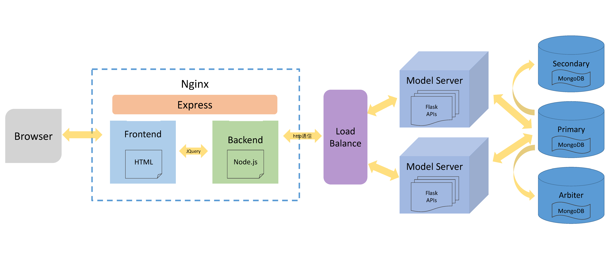
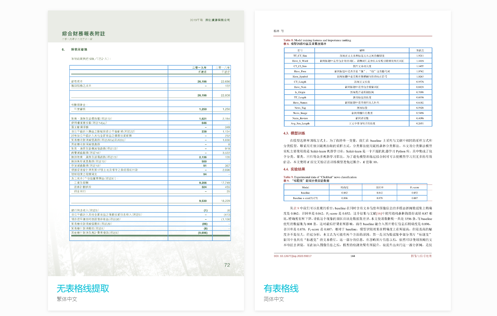
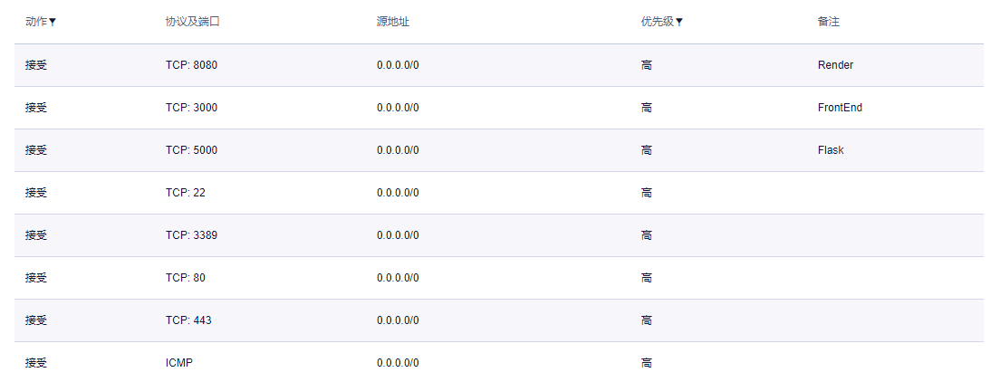
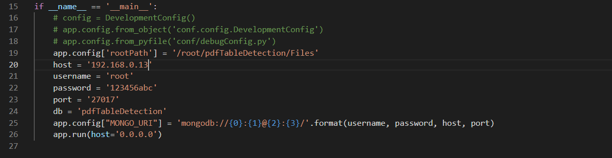
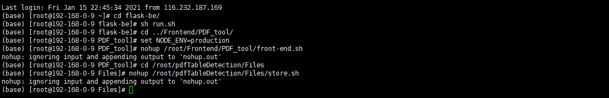
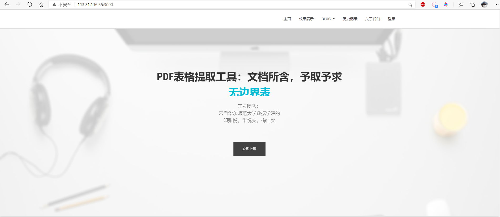
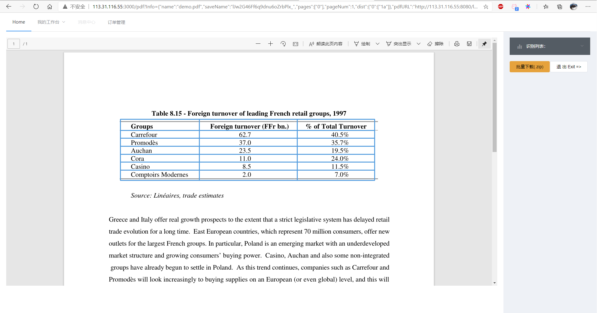

# pdfTableDetection

[](https://pytorch.org/) [](http://www.ruanyifeng.com/blog/2011/05/how_to_choose_free_software_licenses.html)

## 项目介绍
&emsp;&emsp;随着数字化时代的来临，企业生产了海量的电子文档，电子文档中蕴含了许多重要的信息，例如公司财务状况表、现金流量表等，而电子商业文档的处理和信息提取一般由人工来完成，人工提取不仅费时费力，可复用性也不高，对于企业而言限制和阻碍了运行效率，对于员工而言整日机械化的劳动磨灭了创造力与工作热情。因此，电子文档的自动精准快速处理对于提高企业的生产力起到了至关重要的作用。伴随大数据的兴起和深度学习的蓬勃发展，从电子文档中提取有效信息，使大量的数据能够用起来，方便企业深度挖掘数据价值，让数据更好的赋能企业生产，成为当下迫在眉睫的问题。

&emsp;&emsp;因此，本项目应运而生，考虑到表格数据是公司在数据分析时非常关心的数据，本项目主要提取pdf文档中的表格信息，转换成便于企业处理和使用的Excel格式，提高数据的可用性，使企业灵活方便的开采数据价值。

## 项目成员
华东师范大学数据科学与工程学院：印张悦、牛悦安、梅佳奕

## 项目架构
&emsp;&emsp;本项目介绍主要分为前端、后端以及模型三个部分，前端采用Express实现，后端采用Flask实现，模型使用pytorch实现，下图为本项目架构图。


&emsp;&emsp;具体代码部署和运行方式：
- [前端](./frontend/README.md)
- [后端](./flask-be/README.md)
- [模型](./Model/README.md)


## 效果演示
1. 界面演示


2. 表格演示


3. 项目优势


4. 快速预览你的结果


## UCloud部署

- 镜像名称：PDF_Table_Detection
- 镜像ID：uimage-xvzpy3zm
- 用户名：root
- 密码：123456abc
- **在新建云主机时可以设置新的用户名和密码**


本次部署演示仅包括功能测试，需要使用一台云主机和一个MongoDB数据库。

- 云主机IP：113.31.116.55
- MongoDB主节点IP：192.168.0.13
- 密码均为：123456abc

网络部署情况如下，需要开启8080、5000和3000端口，用于渲染、后端和前端。



## 数据库连接

进入initialize_database文件夹，尝试连接数据库，**修改mongo.py中的host为MongoDB主节点IP，以及相应的数据库账号和密码后**，运行如下命令：

```shell
python mongo.py
```

有输出则可以证明数据库连接正常，数据库初始化完毕。

### 后端部署

进入flask-be文件夹，更改app.py中的全局参数

- app.config['rootPath']：上传文件以及生成文件的存储路径
- host、username、password：数据库ip，账号，密码
- 在controllers的pdf.py的runModel函数中，其中需要运行脚本，此路径注意修改



修改完成后运行如下命令：

```shell
cd /root/flask-be/
sh run.sh
```

### 前端部署

1. 修改环境（服务器IP变动）

   打开/root/Frontend/PDF_tool/app.js，在第4行

   ```js
   var HOST_IP = "113.31.116.55"//TODO: 改成当前服务器的ip地址
   ```

   **修改为当前主机IP**

2. 进入前端项目Frontend/PDF-tool文件夹，在命令行执行如下命令

   ```shell
   cd /root/Frontend/PDF_tool/
   set NODE_ENV=production
   nohup /root/Frontend/PDF_tool/front-end.sh
   ```

3. 将指定数据输出路径文件夹提供http访问：

   ```shell
   cd /root/pdfTableDetection/Files
   nohup /root/pdfTableDetection/Files/store.sh
   ```

   以上两个.sh文件以nohup执行后，会在后台静默运行

### 运行和使用

**修改完成相关文件后**，代码汇总如下：



之后即可通过http://113.31.116.55:3000/访问我们的主页：





## License

本项目遵循[MIT License](./LICENSE.md)

