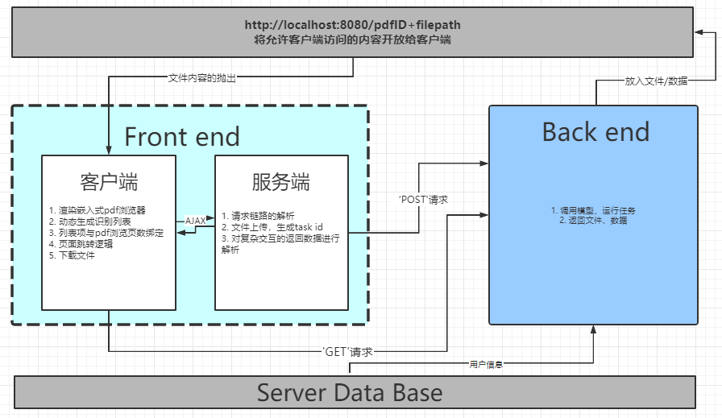

# Frontend Readme
## 环境依赖

- 操作系统：centos 8.2
- nodejs 10.21

#### 环境安装

1. 安装nodejs

   ```
   yum install nodejs
   yum install npm
   ```

   

2. 安装前端相关依赖，在前端项目路径下，执行如下命令

   ```
   npm install
   //全局安装serve包
   npm i -g serve
   ```

## 运行

1. 修改环境（服务器IP变动）

      打开/root/Frontend/PDF_tool/app.js，在第4行
    ```js
    var HOST_IP = "113.31.124.87"//TODO: 改成当前服务器的ip地址
    ```
    
    修改为当前主机IP
    
2. 进入前端项目Frontend/PDF-tool文件夹，在命令行执行如下命令

      ```shell
      cd /root/Frontend/PDF_tool/
      set NODE_ENV=production
      nohup /root/Frontend/PDF_tool/front-end.sh
      ```

3. 将指定数据输出路径文件夹提供http访问：

    ```shell
    cd /root/pdfTableDetection/Files
    nohup /root/pdfTableDetection/Files/store.sh
    ```

    以上两个.sh文件以nohup执行后，会在后台静默运行

## 访问

http://云主机IP:3000/

## 前端选型：

1. 服务端框架：Express
2. pdf渲染：PDFObject
3. 客户端通信：jQuery + AJAX
4. 组件动效：Element-ui + vue + Bootstrap
5. 文件下载：FileSaver

在同类型诸多前端框架（React、Koa等）中选择Express的目的是使用同构渲染（可以看作SSR的一种），从性能上考虑，使服务端与客户端公用一套代码，服务端去渲染，客户端负责交互，可以优化页面响应时长、容错服务端宕机。在实现过程中，凡是服务端中可以抽离的、不涉及与后端交互的函数全部抽离到 `js/my_query_functions.js`中，给客户端直接调用；部分涉及到向后台以GET形式请求数据、但无复杂逻辑的交互（如下载请求），也由客户端直接完成。

#### 技术架构

